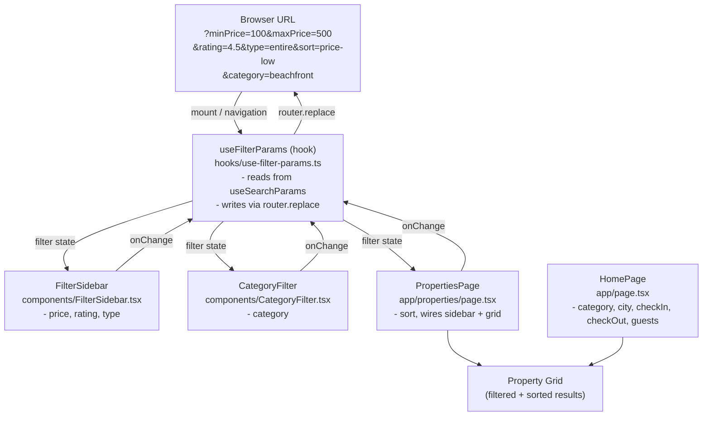

# Design Document — URL Filter Sync

## Overview

This feature adds URL search parameter syncing to Havenly's filter system. Filter state (price range, rating, property type, category, sort order) is serialized into the URL when a user changes a filter, and deserialized back into component state when a page loads. The result is that filtered views survive page refreshes and can be shared via URL.

The implementation is built entirely with Next.js `useSearchParams` and `useRouter` from `next/navigation`. No external state library is added. A single custom hook — `useFilterParams` — owns all serialization/deserialization logic and is consumed by `FilterSidebar`, `CategoryFilter`, and `PropertiesPage`.

---

## Architecture



Key decisions:
- `router.replace` is used instead of `router.push` so filter changes don't pollute the browser history stack.
- Updating params is done by merging into the full current `URLSearchParams` object, so non-filter params (`city`, `checkIn`, `checkOut`, `guests`) are always preserved.
- When a filter value equals its default, the key is deleted from the URL to keep links clean.

---

## Components and Interfaces

### `useFilterParams` hook — `hooks/use-filter-params.ts`

The single source of truth for reading and writing filter state.

```ts
// The shape of all filter params the hook manages
interface FilterParams {
  minPrice: number;       // default: 0
  maxPrice: number;       // default: 1000
  rating: number;         // default: 0
  propertyType: string;   // default: '' (empty = any)
  sortBy: SortOption;     // default: 'featured'
  category: string;       // default: '' (empty = any)
}

// Returned from the hook
interface UseFilterParamsReturn {
  filters: FilterParams;
  setFilters: (partial: Partial<FilterParams>) => void;
  clearFilters: () => void;
}
```

Internally the hook:
1. Calls `useSearchParams()` to read the current URL string.
2. Parses each known key with a typed helper and falls back to defaults on invalid input.
3. `setFilters(partial)` calls `router.replace` with a new `URLSearchParams` built by:
   - Copying all existing params.
   - Applying the partial update.
   - Deleting any key whose value equals the default.
4. `clearFilters()` removes all filter-related keys while keeping non-filter keys.

### `FilterSidebar` — `components/FilterSidebar.tsx`

Gains two new props:

```ts
interface FilterSidebarProps {
  onClose?: () => void;
  isOpen?: boolean;
  // new
  filters: FilterParams;
  onFiltersChange: (partial: Partial<FilterParams>) => void;
}
```

All internal `useState` calls for `priceRange`, `minRating` are removed. Values are read from `filters` prop; changes call `onFiltersChange`. The property type checkboxes gain proper state tracking via `filters.propertyType`.

### `CategoryFilter` — `components/CategoryFilter.tsx`

Already receives `selectedCategory` and `onCategoryChange` as props — no interface changes needed. The parent (`HomePage`) will wire these to `useFilterParams`.

### `PropertiesPage` — `app/properties/page.tsx`

- Calls `useFilterParams()` at the top level.
- Passes `filters` and `onFiltersChange` down to `FilterSidebar`.
- Uses `filters.sortBy` for the sort dropdown.
- Wraps in `<Suspense>` (required by Next.js when using `useSearchParams` in a page).

### `HomePage` — `app/page.tsx`

- The `Home()` inner component already uses `useSearchParams` for city/checkIn/checkOut/guests.
- `selectedCategory` state is replaced with `filters.category` from `useFilterParams`.
- `handleClearFilters` is replaced with `clearFilters()` from the hook.

---

## Data Models

### URL Parameter Keys

| Filter           | URL Key        | Type     | Default     | Notes                                  |
|------------------|----------------|----------|-------------|----------------------------------------|
| Min price        | `minPrice`     | number   | `0`         | Integer, dollars                       |
| Max price        | `maxPrice`     | number   | `1000`      | Integer, dollars                       |
| Min rating       | `rating`       | number   | `0`         | One decimal place, e.g. `4.5`          |
| Property type    | `type`         | string   | `''`        | `'entire'`, `'room'`, `'shared'`, `''` |
| Sort order       | `sort`         | string   | `'featured'`| `'featured'`, `'price-low'`, `'price-high'`, `'rating'` |
| Category         | `category`     | string   | `''`        | Any category id from `dummy-data.ts`   |

Non-filter params managed elsewhere (not touched by `useFilterParams`):

| Param       | Managed by            |
|-------------|-----------------------|
| `city`      | `ExpandedSearchBar`   |
| `checkIn`   | `ExpandedSearchBar`   |
| `checkOut`  | `ExpandedSearchBar`   |
| `guests`    | `ExpandedSearchBar`   |

### Serialization helpers (internal to hook)

```ts
// safe parse — returns fallback on NaN / missing
function parseNum(value: string | null, fallback: number): number
function parseStr(value: string | null, fallback: string): string
```

---

## Error Handling

| Scenario                                      | Behavior                                                  |
|-----------------------------------------------|-----------------------------------------------------------|
| URL param is not a valid number               | `parseNum` returns the default; no error is thrown        |
| URL param for type/sort is not a known value  | `parseStr` returns the default                            |
| `useSearchParams` returns null for a key      | Treated the same as missing — default is used             |
| User manually types an out-of-range price     | Clamped client-side in `FilterSidebar` (min 0, max 10000) |

---

## Testing Strategy

Unit tests cover the hook's serialization/deserialization logic in isolation using a mock `useSearchParams` and `useRouter`. The component integration (FilterSidebar reading from and writing to the hook) is covered by rendering the component with a mocked router context.

Tests live in `hooks/__tests__/use-filter-params.test.ts`.
